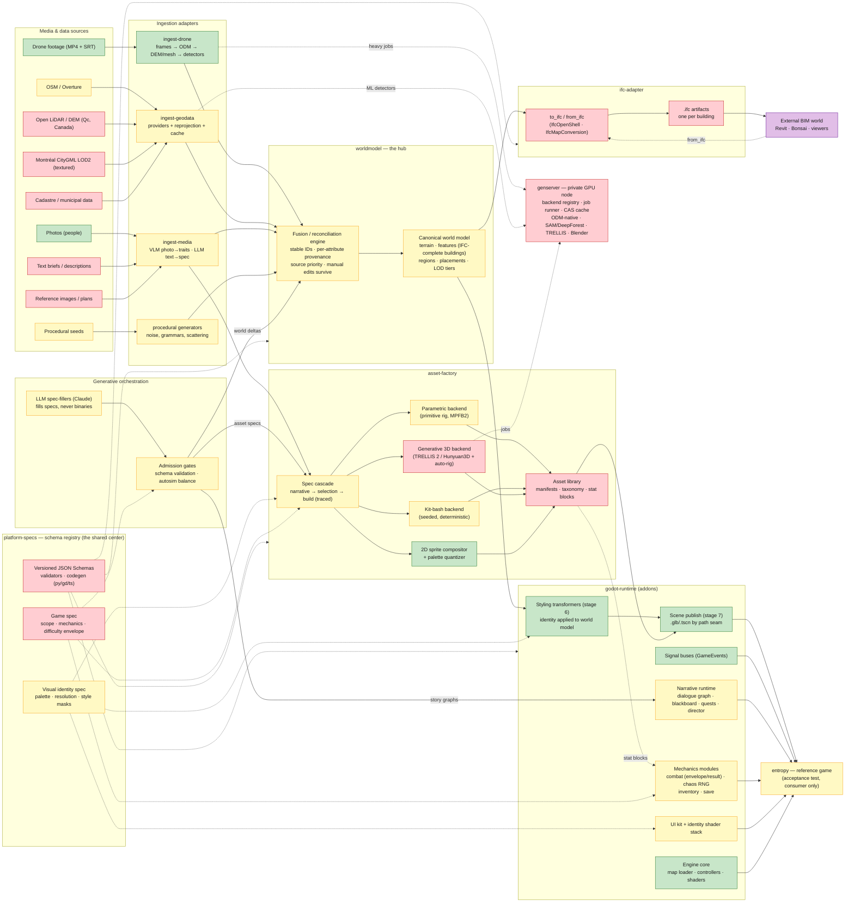

# Platform architecture — working diagram

**Living document.** This is the artifact we comment on, edit, and eventually
lock. Prose rationale lives in the
[architecture brief](explorations/2026-07-08-platform-architecture.md);
this file is the structural source of truth once locked.

- **Color = gap status** (from brief §11): green = have (working prototype
  somewhere in the four repos) · yellow = partial · red = missing · purple =
  external to the platform.
- Solid arrows = data/artifact flow. Dashed arrows = spec/contract
  dependency or compute offload.
- Each box maps to a module of the constellation (brief §10) — i.e., a
  candidate repo / Claude project.

## Reading notes

- **The hub discipline:** nothing flows source → consumer directly; every
  ingested thing becomes world-model content (with provenance) or a spec.
  The one deliberate exception: `ingest-media → cascade` (a photo or chat
  fills a character spec without touching the world model).
- **The IFC dual emission** (acceptance scenario §1b): a building leaves the
  world model twice — as a styled game asset via `styler → publish`, and as
  a standalone `.ifc` via `to_ifc`. Both projections of one IFC-complete
  record.
- **`platform-specs` has no data flow** — only dashed contract edges. It is
  the center precisely because it does nothing at runtime.
- **`genserver` is invisible to callers** — dashed offload edges only;
  no module's contract changes based on where a backend ran.
- **`entropy` consumes everything and feeds nothing** — the dependency
  direction that keeps the platform honest.

## Decisions to lock (the commenting agenda)

- [ ] **Module boundaries**: is the §10 repo split right? (e.g. does
  `narrative` start inside `godot-runtime`? is `asset-factory` one repo or
  per-family?)
- [ ] **World model scope**: single per-scene document vs. game-scoped store
  with per-scene views (brief §7.8).
- [ ] **IFC-complete building schema**: which attributes are mandatory at
  which LOD tier?
- [ ] **Spec registry mechanics**: JSON Schema everywhere? codegen targets?
  version-pinning convention between repos?
- [ ] **The `gate` placement**: are validators a shared service (as drawn)
  or embedded per-module?
- [ ] **2D/3D duality** (brief §7.3): is `b_2d` a first-class backend of the
  same asset library, or a separate 2D track?
- [ ] **Where manual editing enters**: Godot editor plugins vs. spec-file
  editing vs. dedicated tools — currently implicit.
- [ ] **Naming**: module names above are placeholders; lock them when repos
  are created.

## Changelog

- 2026-07-08 — v0.1: initial diagram from the architecture brief (§2, §10,
  §11 statuses).
